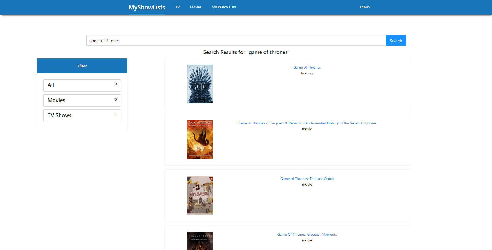

# ShowApp

ShowApp is an application that allows users search and retrieve information about tv shows and movies. Users can also add shows to collections such as Completed, On Hold, Currently Watching and etc.

## Project Status

This project has mostly been completed. Users may search by the title of the movie or show and retrieve relevant information such as the synopsis (TMDB/IMDB), release date, genres, runtime and the status. They can also register and login through the navbar buttons. Once authorized, users can add shows and movies to one of the default collections (Currently Watching / Completed / On Hold / Dropped / Plan to Watch). They can assign a rating to the show, add comments and change the status as needed. 

The design of the website draws heavily from two sites MyAnimeList and MyDramaList. APIs that were used were TMDB for most of the shows information and IMDB for rating and additional synopsis. 

Given time, I would like to add additional features to the application that include:

* Creating custom collections for users.

* Add a more unique home page other than a search bar.

* Allow Users to make their lists public and look up other user's watchlist.

## Project Screen Shots





## Installation and Setup Instructions

Clone this repository and you will need node and npm installed globally on your machine. The web application also uses PostgreSQL as the default database.

Frontend Installation:

```bash
npm install or yarn add
```

To Start Server:

```bash
npm run or yarn start
```

To Visit App:
localhost:3000

Backend Installation

Navigate to where requirements.txt is.

```bash
pip install -r requirements.txt
```
